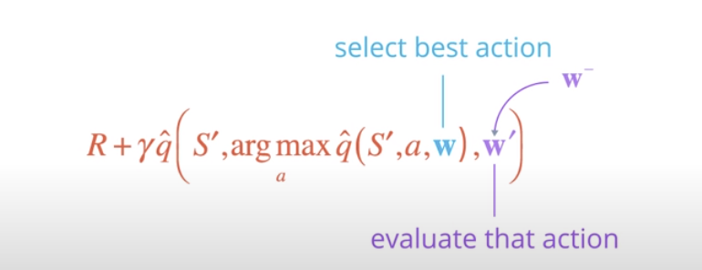
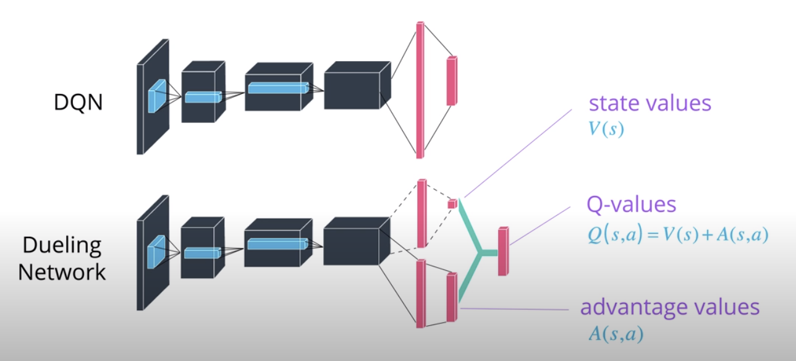

# Deep Reinforcement Learning

### Project 1: Navigation in banana envirornement

##### Overview:

The aim of this project is to train an agent to learn how to navigate in the banana evironmenet by collecting yellow bananas and avoid blue ones. The report describes my implementation of a deep Q-network (DQN) agent. My solution implements a deep Q-network (DQN) agent using the following techniques:

- Double DQN: https://arxiv.org/pdf/1509.06461.pdf
- Dueling DQN: https://arxiv.org/pdf/1511.06581.pdf

#### Architecture:

- ###### DQN:

  In Q-learning, we aim to learn the Q table. In fact, Q (s, a) values Q-values represents the maximum discounted future reward for all possible combinations of s and a, and gives the performance of your agent when performing an action in state s. However, Once we have a large number of states and actions, this table Q is no longer effective because it is difficult to represent. This is where the idea for DEEP Q-Learning came from. The representation of Q will be done using a non linear function or a neural network which takes input actions. The DQN has the weights parameter θ and tries to learn to choose an optimal action. To make this modelisation even more stable, one good technique is to use exprerience replay. It consists on storing experience tuples (s, a, r, s') in replay memory D, and during training we use andom mini-batches from the replay memory and this has shown a great improvement in the agent behavior.

- ###### Double DQN:

  With this technique we seek more stability for the learning. for this, we use two similar neural networks 'local' and 'target'. The first one learns during the experience replay and the second one is a copy of the last episode of the first model and is used to calculate the target Q value. In other terms, we use the local model to get the indexes that give the best Q value and. Then we use them with the target network to get the best action.
  

- ###### Dueling DQN:

  The idea behind duel DQN is to change the model architecture. We will compute the value state function Q(s,a) as the sum of the Value function V(s) and an Advantage function A(s,a). Here, the value function tells how good it is to be in a state. The Q function measures how good is to choose a particular action when in this state.Thus, the advantage function subtracts the value of the state from the Q function to obtain a relative measure of the importance of each action.

  tion, however, measures the the value
of choosing a particular action when in this state. The advantage function subtracts the value of the state from the Q
function to obtain a relative measure of the importance of
each action.

  

#### Code description:

- model.py : 
- dqn.py
- agent.py
- 

#### Hyperparameters:

#### Results:

#### Future Work:

    Add Prioritized Experience Replay
