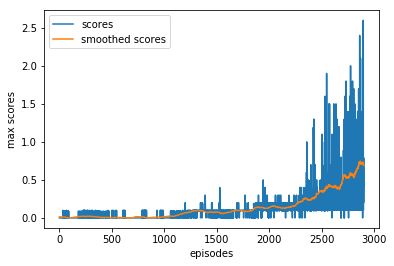

# Deep Reinforcement Learning

### Project 3: Collaboration and Competition in Tennis environment

##### Overview:

The aim of this project is to train two agents to play tennis together while being competitive and collaborative at the same time. The goal of each agent is to keep the ball playing the longest possible time. For this project, I used the same DDPG algorithm adapted for multi agents.

#### DDPG for Multi-Agents :

In order to adapt the DDPG implementation to this project, I used the same actor and critic networks architechture as well as the same agent definition. The logic behind this algorithm and its implementation was described in my previous project.
As we are dealing with two tennis players, I started two instances of the agent structure, represented by Agent1 and Agent2. In this environment, the state space is diffrent, thus it required some changes in the way we take states and actions from the environment, then every agent will try to reach the better convergence using the state and its own action.

#### Code description:

- model.py : definition of the model architechture of the actor and critic networks.
- multi_ddpg.py : implementation of DDPG algorithm with multi agents
- agent.py : implementation of agent using DDPG and some improvements.
- Tennis.ipynb : start environment, test it, train agents and plot scores.

#### Hyperparameters:

- BUFFER_SIZE : int(1e6) # replay buffer size
- BATCH_SIZE : 256 # minibatch size
- GAMMA : 0.99 # discount factor
- TAU : 1e-3 # for soft update of target parameters
- LR_ACTOR : 1e-3 # learning rate of the actor
- LR_CRITIC : 1e-3 # learning rate of the critic
- WEIGHT_DECAY : 0 # L2 weight decay
- UPDATE_EVERY : 20 # timesteps between updates
- EPSILON : 1.0 # epsilon for the noise process added to the actions
- EPSILON_DECAY : 1e-6 # decay for epsilon above

#### Results:

#### Future Work:

- Benchmarking different algorithms for multi agents tasks.
- Go deeper in "Multi-Agent Actor-Critic for Mixed Cooperative-Competitive Environments" paper (https://arxiv.org/pdf/1706.02275.pdf).
